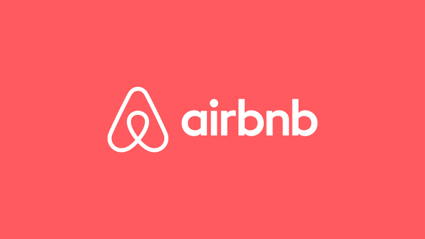

<!-- PROJECT LOGO -->
 

<!--  mengarah ke repo  -->
  

  <h3 align="center">Project Airbnb</h3>

  

    Project Airbnb Program Immersive Back End Batch 4
     
    <a href="https://github.com/sahrilmahendra/project2-airbnb"><strong>Explore the docs »</strong></a>
     
  

<!-- ABOUT THE PROJECT -->
## About The Project

<!-- [![Product Name Screen Shot][product-screenshot]](https://example.com) -->

Airbnb merupakan marketplace yang digunakan untuk memesan tempat penginapan dan homestay.
Berikut merupakan fitur yang terdapat dalam project ini :

      <ul>
        <li><h5>Users</h5></li>
        
Users dapat melakukan Create, Read, Update, Delete (CRUD) pada data user.
         User yang telah melakukan registrasi (create) dapat melakukan login.

        <li><h5>Homestay</h5></a></li>
        
Users dapat melakukan Create, Read, Update, Delete (CRUD) pada data homestay.
         Fitur Update dan Delete hanya dapat dilakukan pada homestay miliknya sendiri.
         User dapat melihat semua data homestay termasuk homestay yang dimilikinya sendiri.

        <li><h5>Reservation</h5></a></li>
        
Users dapat melakukan reservation homestay.
         Users dapat mengecek ketersediaan homestay.
         Users dapat melihat data reservation.

      </ul>

(<a href="#top">back to top</a>)

### Built With

<!-- * [Golang](https://golang.org/)
* [Echo Framework](https://echo.labstack.com/)
* [MySQL](https://www.mysql.com/)
* [Gorm](https://gorm.io/)
* [JWT](https://echo.labstack.com/cookbook/jwt)
* [Assert](https://pkg.go.dev/github.com/stretchr/testify/assert)
* [VS Code](https://code.visualstudio.com/) -->
&nbsp;
&nbsp;
&nbsp;

(<a href="#top">back to top</a>)

<!-- ERD -->
## ERD

<!-- CONTACT -->
## Contact

Project Link: [https://github.com/sahrilmahendra/project2-airbnb](https://github.com/sahrilmahendra/project2-airbnb)
<!-- :heart: -->
<!-- CONTRIBUTOR -->
Contributor :
 

 
Mentor :
 
<!-- https://www.linkedin.com/in/iffakhry/ -->

(<a href="#top">back to top</a>)

<h3>

:copyright: 2021 | Built with :heart: from us

</h3>